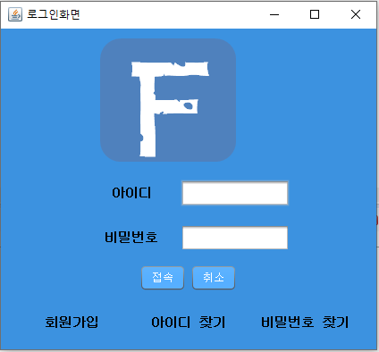
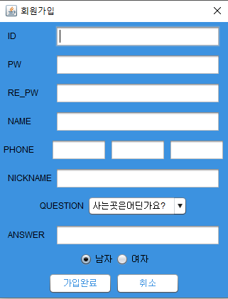
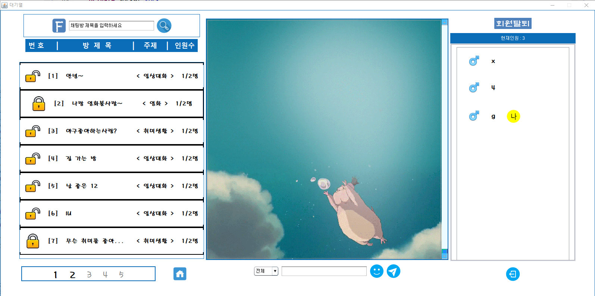
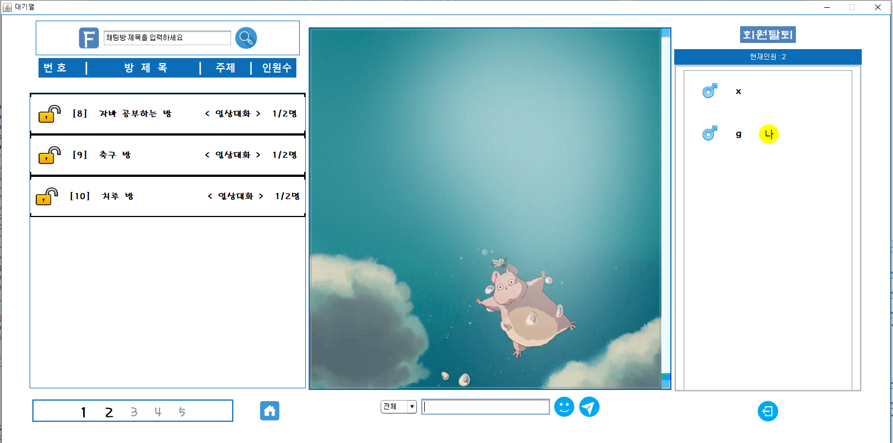
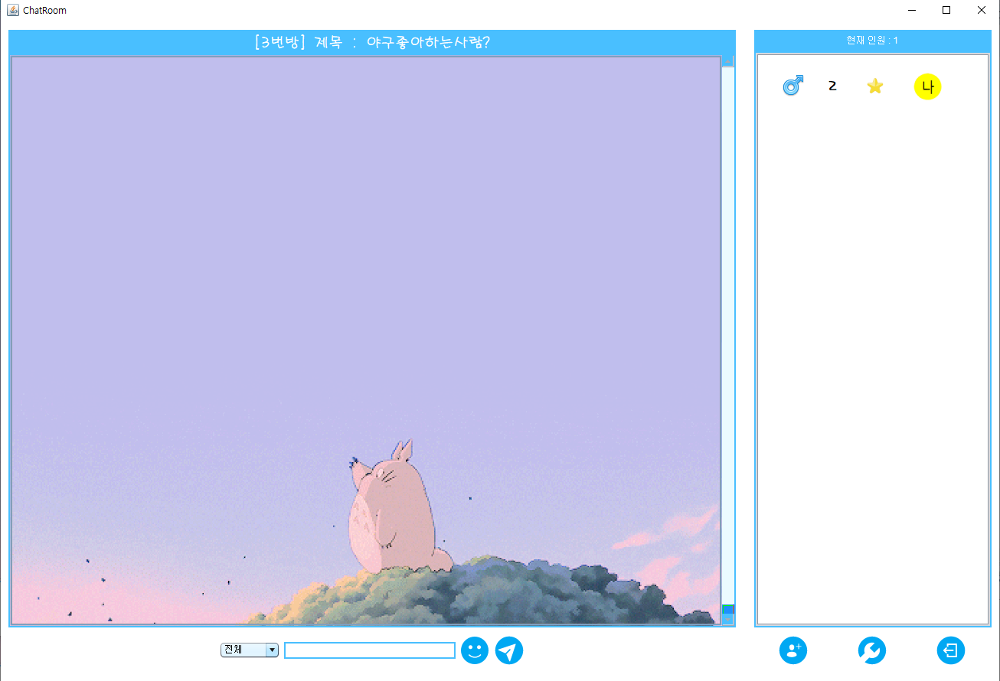
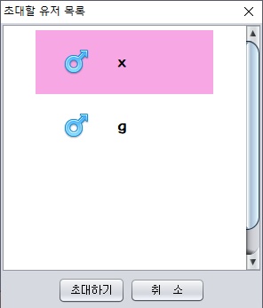

# ChattingProgram

* 서버, 클라이언트 소켓을 이용한 채팅프로그램

* 회원가입
 * 아이디, 패스워드, 닉네임, 이름, 질문(답변), 성별 입력
 * 확인을 눌렸을때 서버로 보낸 다음 Stream에 저장

* 아이디 찾기
  * 이름과 전화번호 입력
  * 확인을 눌릴때 서버로 보냄

* 비밀번호 찾기 및 변경
  * 아이디, 이름, 질문(답변) 입력
  * 확인을 눌릴때 서버로 보냄

* 접속성공
  * 대기실 UI로 보냄
    * 기능(서버로 보내기)
      * 채팅방 검색(방 제목으로만)
      * 채팅방패널 페이징 5개(CardLayout)
      * 대기실 채팅
      * 대기실 이모티콘(움직이는이모티콘포함)
      * 대기실 유저목록 리스트
      * 회원탈퇴, 로그아웃

* 방들어가기
  * 채팅방 UI로 보냄
    * 기능(서버로 보내기)
      * 초대유저목록리스트(대기실유저만)
      * 방설정(비밀방 가능)
      * 방에대한 방장(위임기능, 추방기능)
      * 귓속말 기능(대기실:대기실, 대기실:채팅방, 채팅방:채팅방)
      * 방장이 방을 나갔을시, 방장 랜덤 위임
      * 채팅방 채팅
      * 채팅방 이모티콘(움직이는이모티콘포함)

* 피드백 받은것들
  * 초대유저목록 4명이상으론 보이지 않는 현상
  * 초대유저목록에서 유저를 선택 안했을시 NULL값이 뜨고 클라이언트 멈춤현상
  * 가끔 클라이언트가 바로꺼짐 현상
  * 제목을 공백으로 하고 리스트 클릭할때 오류
  * 비밀번호 찾기 쪽 오류..? WHY? (classDeFount오류가떴다고함)
  * 이모티콘 다발적으로 보낼때 서버가 터짐현상
  * 가끔 대기실에서 클라이언트 소켓 닫힘 현상
  * 유저정보 변경 하는 기능이 있었으면 좋겠다.

**

UI
**

* 로그인화면

* 회원가입

* 대기실

* 페이징

* 채팅방

* 초대목록

  

